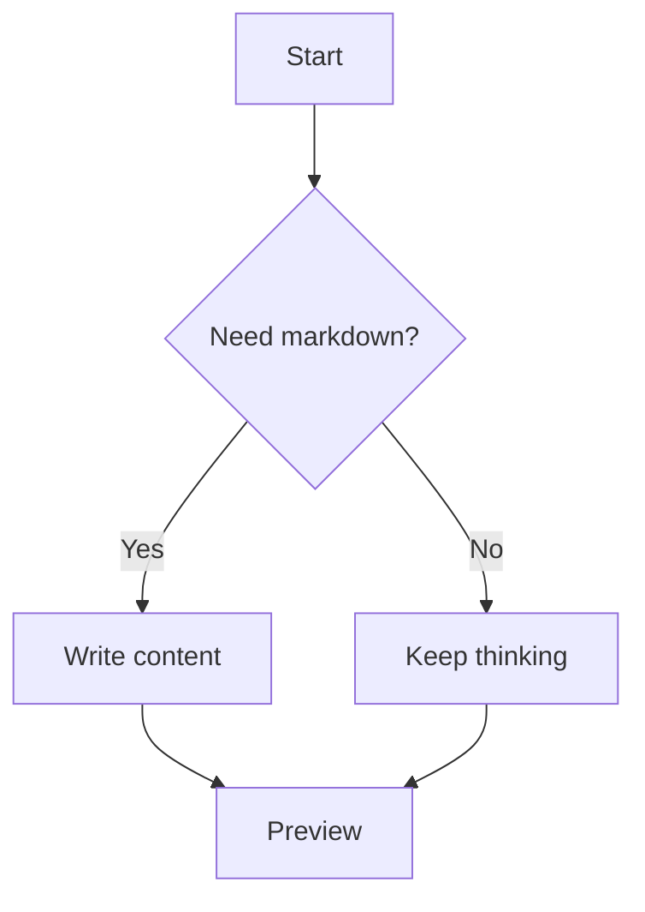
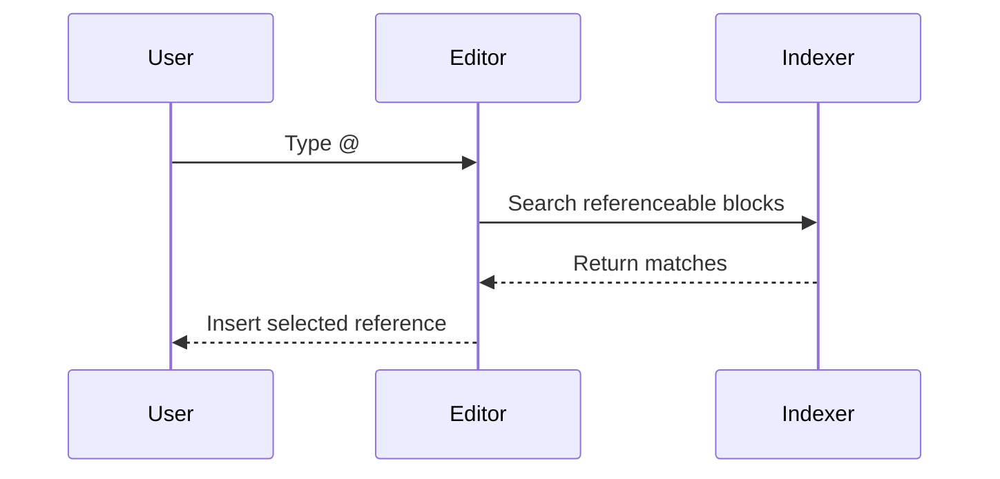
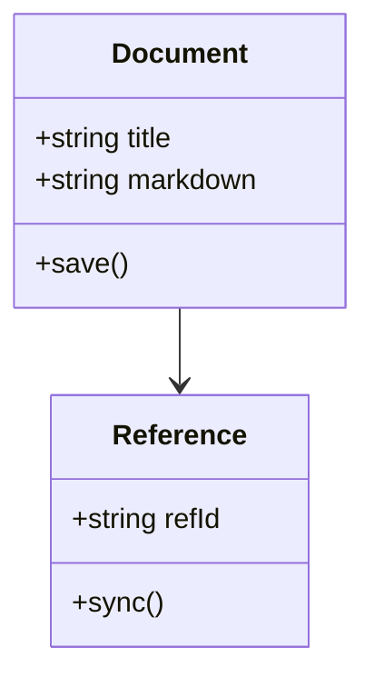
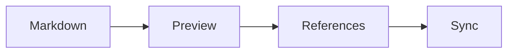

# Marktype Markdown Test Tutorial

Paste this whole document into the editor to test markdown preview, syntax highlighting, math, diagrams, tables, images, custom blocks, and referenceable objects.

---

## 1. Headings

# Heading 1

## Heading 2

### Heading 3

#### Heading 4

##### Heading 5

###### Heading 6

---

## 2. Inline Formatting

This paragraph includes **bold text**, __also bold__, *italic text*, _also italic_, ***bold italic***, ~~strikethrough~~, `inline code`, and a normal sentence after it.

You can mix links with emphasis: [OpenAI](https://openai.com), **[bold link](https://example.com)**, and an automatic-looking URL: https://example.com.

Escaped markdown should remain literal: \*not italic\*, \`not code\`, and \$not math\$.

---

## 3. Lists

Unordered list:

- Apples
- Oranges
- Pears
  - Green pears
  - Red pears

Ordered list:

1. Draft
2. Write
3. Revise
4. Publish

Task list:

- [x] Render checkboxes
- [ ] Toggle incomplete task
- [ ] Keep indentation stable

---

## 4. Blockquotes

> A blockquote should get a quiet left border.
> It can continue across multiple lines.

Nested blockquote:

> Outer quote
>
> > Inner quote

---

## 5. Tables

| Feature | Syntax | Expected Preview |
| --- | --- | --- |
| Bold | `**text**` | Strong text |
| Inline math | `$x^2$` | Rendered KaTeX |
| Diagrams | ```mermaid``` | Rendered Mermaid block |
| References | `ref="id"` | Searchable with `@` |

Referenceable table:

| Name | Role | Status |
| --- | --- | --- |
| Ada | Research | Active |
| Grace | Systems | Active |
| Katherine | Analysis | Active |

{ref="people-table"}

After saving/indexing, type `@people-table` somewhere else to test table references.

---

## 6. Code Blocks

CodeMirror already handles editor-side syntax highlighting for many fenced languages.

Referenceable JavaScript:

```javascript id="hello-js" ref="hello-js"
const name = "Marktype";
function greet(person) {
  return `Hello, ${person}!`;
}

console.log(greet(name));
```

Referenceable Python:

```python id="hello-python" ref="hello-python"
from dataclasses import dataclass

@dataclass
class User:
    name: str
    active: bool = True

print(User("Ada"))
```

Rust:

```rust id="hello-rust" ref="hello-rust"
fn main() {
    let values = vec![1, 2, 3, 4];
    let total: i32 = values.iter().sum();
    println!("total = {}", total);
}
```

JSON:

```json ref="sample-json"
{
  "name": "Marktype",
  "features": ["markdown", "math", "diagrams", "references"],
  "ready": true
}
```

Bash:

```bash ref="sample-bash"
echo "Listing markdown files"
find . -name "*.md" -maxdepth 3
```

Plain text fallback:

```text ref="plain-note"
This is a plain text block.
It should still be referenceable, even without language-specific highlighting.
```

---

## 7. Math

Inline math should render inside text: $E = mc^2$, $a^2 + b^2 = c^2$, and $\int_0^1 x^2 dx = \frac{1}{3}$.

Block math:

$$
\frac{d}{dx}\left( x^n \right) = n x^{n-1}
$$

Referenceable math block:

$$ {ref="energy-equation"}
E = mc^2
$$

Another referenceable math block:

$$ {ref="bayes-rule"}
P(A \mid B) = \frac{P(B \mid A)P(A)}{P(B)}
$$

After saving/indexing, type `@energy-equation` or `@bayes-rule` to test math references.

---

## 8. Mermaid Diagrams

Flowchart:



Sequence diagram:



Class diagram:



After saving/indexing, type `@flowchart-demo`, `@sequence-demo`, or `@class-demo` to test diagram references.

---

## 9. Images

Remote image:


Reference-style image:

![Reference image][sample-image]

[sample-image]: https://placehold.co/480x180/png "Reference image title"

Referenceable standalone image:

 {ref="placeholder-image"}

After saving/indexing, type `@placeholder-image` to test image references.

---

## 10. Reference-Style Links

This is a [reference-style link][docs-link].

[docs-link]: https://commonmark.org/help/ "CommonMark help"

This should preserve the existing markdown reference-definition behavior used by links and images.

---

## 11. Custom Block Tags

<note>
This is a note block. The opening and closing tags should collapse or show based on live preview settings.
</note>

<warning>
This is a warning block. It should have a different accent from the note block.
</warning>

<tip>
This is a tip block. Use it for helpful side information.
</tip>

<details>
This is a details block. It should keep the content visually grouped.
</details>

---

## 12. Mixed Content Stress Test

Here is a paragraph with **bold**, `inline code`, inline math $\sqrt{144} = 12$, a [link](https://example.com), and a reference-style image below.

| Metric | Formula | Result |
| --- | --- | --- |
| Area | `$A = \pi r^2$` | Circle area |
| Energy | `$E = mc^2$` | Mass-energy |

```typescript ref="mixed-typescript"
type MarkdownFeature = {
  name: string;
  enabled: boolean;
};

const features: MarkdownFeature[] = [
  { name: "math", enabled: true },
  { name: "diagrams", enabled: true },
  { name: "references", enabled: true },
];

console.table(features);
```

$$ {ref="quadratic-formula"}
x = \frac{-b \pm \sqrt{b^2 - 4ac}}{2a}
$$



---

## 13. Reference Picker Checklist

After saving or letting the workspace index this document, try typing `@` and searching for:

- `hello-js`
- `hello-python`
- `hello-rust`
- `sample-json`
- `energy-equation`
- `bayes-rule`
- `flowchart-demo`
- `sequence-demo`
- `placeholder-image`
- `people-table`
- `quadratic-formula`
- `mixed-diagram`

Expected behavior:

1. Code blocks appear as `CodeBlock` entries and may offer insert or run actions.
2. Mermaid blocks appear as `Diagram` entries.
3. Math blocks appear as `MathBlock` entries.
4. Tables and images remain referenceable when they include `ref="..."`.
5. Inserted references should preserve their original markdown shape.

---

## 14. Editing Test

Move your cursor into each preview block. Nearby block previews should reveal the source markdown so you can edit it. Move the cursor away and the preview should return.

Try changing:

- `$E = mc^2$` to `$F = ma$`
- `graph TD` to `flowchart LR`
- A table cell value
- A code block language from `javascript` to `python`
- A `ref="..."` id, then search for the new id with `@`

